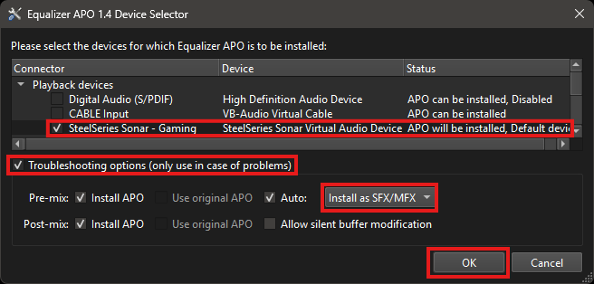
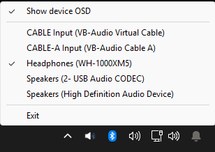

# Virtual Surround Sound

Scripts to install and use the SteelSeries Sonar virtual 7.1 audio device on Windows 10 and Windows 11.

Pair the virtual audio device with HeSuVi for HRTF-based virtual surround.
The VAD provides 7.1 channels, not spatial processing.

## Prerequisites

- Windows 10 or Windows 11
- [Equalizer APO](https://sourceforge.net/projects/equalizerapo/)
- [AutoHotkey v2](https://www.autohotkey.com/) (for volume OSD and device switching)

## Step 1: Install Driver

1. Clone or download this repository.
2. Download a SteelSeries GG installer:
  - [v14-v24](https://drivers.softpedia.com/get/KEYBOARD-and-MOUSE/Steelseries/SteelSeries-GG-Utility-18-0-0-64-bit.shtml) - Recommended for 48kHz support
  - [Latest](https://steelseries.com/gg/downloads/gg/latest/windows) - 96kHz only
3. Drag the SteelSeries GG installer onto `scripts\vss-driver-extract.bat`.
4. Run `driver\install.bat` as admin.

## Step 2: Route Audio

Route audio through the Sonar VAD to a physical output device.

Option A: run `scripts\vss-volume-osd.ahk`, click the tray icon to select a device.

Option B: run `scripts\vss-device-select.bat` for a console-based device picker.

Optional: run `tasks\import_tasks.bat` to auto-route on audio device changes.
Task Scheduler points to this repo folder, so do not move or delete the repo after import.

## Step 3: Equalizer APO (optional)

1. Install Equalizer APO.
2. Open Equalizer APO Device Selector.
3. Tick `SteelSeries Sonar - Gaming`.
4. Tick `Troubleshooting Options`, select `Install as SFX/MFX`.
5. Click OK, do not reboot when prompted.
6. Restart Windows Audio service.

## Step 4: HeSuVi (optional)

Install [HeSuVi](https://sourceforge.net/projects/hesuvi/) for HRTF-based virtual surround processing.
Requires Equalizer APO (Step 3).

## Volume OSD

`scripts\vss-volume-osd.ahk` handles `Volume Up`/`Volume Down` and shows a volume overlay with the active device name.

Click or right-click the tray icon to switch output device or toggle the device OSD.

- Scroll on the tray icon to adjust volume
- Only active when `SteelSeries Sonar - Gaming` is the default device
- Ignores remote mouse focus from `PowerToys.MouseWithoutBordersHelper.exe`

## Version Notes

| Version | Bit depth | Sample rate | Notes |
|---|---:|---:|---|
| 14.0.0-24.0.0 | 16-bit | 48 kHz | Driver in `sonar\driver`. Leaner package. |
| 25.0.0-27.x | 24-bit | 96 kHz | Driver in `sonar\driver`. Needs render-state and gain keys. |
| 28.0.0-111.0.0 | 24-bit | 96 kHz | Driver path changed to `apps\sonar\driver`. |
| 112.0.0+ | 24-bit | 96 kHz | Device installer moved to `shared\Steelseries.AudioDeviceInstaller.exe`. |

Recommended: v14-v24.
Reason: HeSuVi ships 48 kHz HRIR files by default, no sample-rate conversion needed.

## Notes

Architecture details: `docs\sonar-apo-internals.md`.

Credits:
- SteelSeries, Sonar virtual audio device
- NirSoft, SoundVolumeView
